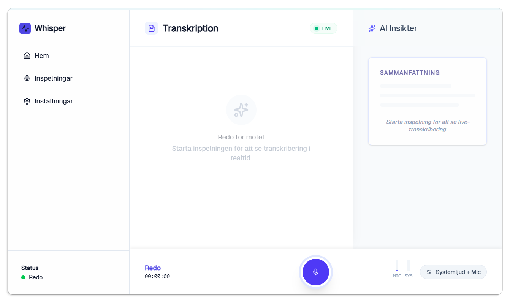

# Sagt.ai Desktop

**Free, private, offline meeting transcription for Swedish.**

[Download for Windows →](https://downloads.sagt.ai/Sagt.ai-setup.exe) | [sagt.ai](https://sagt.ai)



---

> **Early access:** This is a public beta. Expect rough edges. If something breaks, [open an issue](../../issues) — we read every one.

---

## What it does

- **Records and transcribes in real time** — text appears on screen as you speak, with ~1–3 s latency
- **100% local on the free tier** — the KB-Whisper model runs on your own CPU. Zero audio leaves your machine
- **AI meeting protocol on Pro** — summaries, decisions, and action items generated by Llama 3.3 via Berget.ai (EU, Finland). Never outside Europe
- **Works offline** — records and transcribes without an internet connection on the free tier

## Free vs Pro

|  | Free | Pro (199 kr/month) |
|---|---|---|
| Local real-time transcription | ✅ Unlimited | ✅ |
| KB-Whisper Small (offline) | ✅ | ✅ |
| AI meeting summary | — | ✅ |
| Key decisions & action items | — | ✅ |
| Cloud sync (KB-Whisper Large, higher accuracy) | — | ✅ |
| Data ever leaves EU | ❌ Never | ❌ Never |

## Why KB-Whisper?

KB-Whisper is trained by [Kungliga Biblioteket](https://kb.se) (the National Library of Sweden) on Swedish parliamentary debates, radio, and broadcast speech. It makes 3–8× fewer errors on Swedish names, dialects, and terminology compared to generic Whisper models.

## Privacy — verifiable

During local transcription, the app makes zero external network calls. You can verify this yourself in Windows Task Manager → Resource Monitor → Network, or in any network monitoring tool. The source code for the audio pipeline is in [`src-tauri/src/audio.rs`](src-tauri/src/audio.rs).

## Installation

1. [Download the signed Windows installer](https://downloads.sagt.ai/Sagt.ai-setup.exe)
2. Run `Sagt.ai-setup.exe` — signed with Azure Trusted Signing, no SmartScreen warning
3. Launch Sagt.ai and start your first recording

The app auto-updates in the background when a new version is available.

## Releases & build provenance

This repository is the **source mirror** for the desktop app — it exists so you can audit exactly what the app does. It is synced at every release and tagged with the same version as the official installer.

Official binaries are built, code-signed (Azure Trusted Signing) and published from the maintainers' release pipeline — **not** from this repository. By design, this repo contains **no release credentials, no signing keys and no publishing pipeline**; its CI only typechecks and compiles the code. This keeps the attack surface of the public repo at zero while the code stays fully reviewable.

## Build from source

Prerequisites: [Rust toolchain](https://rustup.rs) and [Node.js 20+](https://nodejs.org).

```bash
npm install
cp .env.example .env   # fill in your values
npm run tauri:dev      # opens the app with DevTools (F12) enabled
```

TypeScript check:
```bash
npx tsc --noEmit
```

> **Note:** The `ggml-kb-whisper-small.bin` model file is not included in this repository — it is fetched from a private bucket during official CI builds. For local development you can substitute any GGML-compatible Whisper model and place it at `src-tauri/resources/models/ggml-kb-whisper-small.bin`.

## Tech stack

- [Tauri v2](https://tauri.app) (Rust + WebView2)
- React + TypeScript + Tailwind CSS
- [KB-Whisper](https://huggingface.co/KBLab) via local `whisper-cli` sidecar (beam-size 1, VAD-gated)
- SQLite for local recording storage

## Contributing

See [CONTRIBUTING.md](CONTRIBUTING.md). Windows is the primary platform; Mac PRs are welcome but review time is not guaranteed.

Security issues: see [SECURITY.md](SECURITY.md) — please do not open public issues for vulnerabilities.

## License

MIT — see [LICENSE](LICENSE).

"Sagt.ai" is a trademark of EDI Labs AB. Forks must use a different name and remove all Sagt.ai branding.
